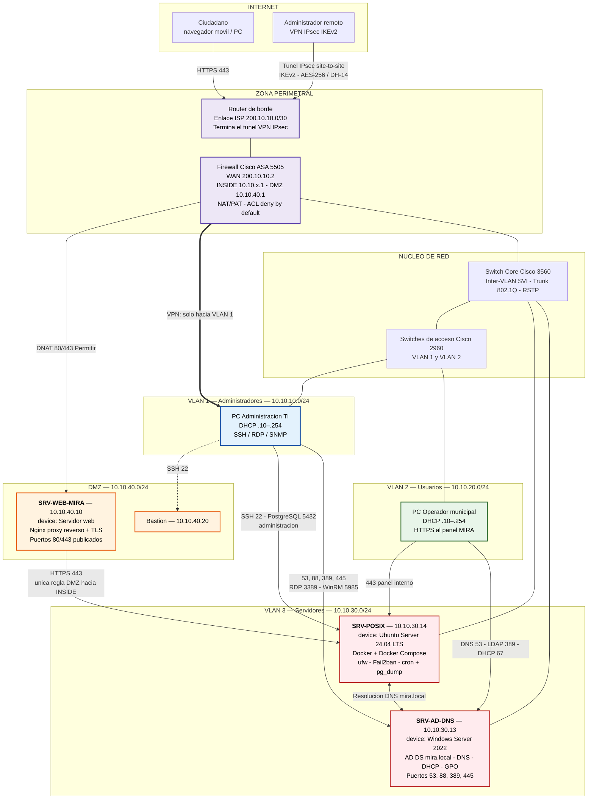

```mermaid
flowchart TB
    subgraph INET["INTERNET"]
        CIU["Ciudadano<br/>navegador movil / PC"]
        ADMREM["Administrador remoto<br/>VPN IPsec IKEv2"]
    end

    subgraph PERIM["ZONA PERIMETRAL"]
        RTR["Router de borde<br/>Enlace ISP 200.10.10.0/30<br/>Termina el tunel VPN IPsec"]
        ASA["Firewall Cisco ASA 5505<br/>WAN 200.10.10.2<br/>INSIDE 10.10.x.1 - DMZ 10.10.40.1<br/>NAT/PAT - ACL deny by default"]
    end

    subgraph DMZ["DMZ — 10.10.40.0/24"]
        WEB["<b>SRV-WEB-MIRA</b> — 10.10.40.10<br/>device: Servidor web<br/>Nginx proxy reverso + TLS<br/>Puertos 80/443 publicados"]
        BAST["Bastion — 10.10.40.20"]
    end

    subgraph CORE["NUCLEO DE RED"]
        SW3560["Switch Core Cisco 3560<br/>Inter-VLAN SVI - Trunk 802.1Q - RSTP"]
        SW2960["Switches de acceso Cisco 2960<br/>VLAN 1 y VLAN 2"]
    end

    subgraph VLAN1["VLAN 1 — Administradores — 10.10.10.0/24"]
        PCADM["PC Administracion TI<br/>DHCP .10–.254<br/>SSH / RDP / SNMP"]
    end

    subgraph VLAN2["VLAN 2 — Usuarios — 10.10.20.0/24"]
        PCOP["PC Operador municipal<br/>DHCP .10–.254<br/>HTTPS al panel MIRA"]
    end

    subgraph VLAN3["VLAN 3 — Servidores — 10.10.30.0/24"]
        POSIX["<b>SRV-POSIX</b> — 10.10.30.14<br/>device: Ubuntu Server 24.04 LTS<br/>Docker + Docker Compose<br/>ufw - Fail2ban - cron + pg_dump"]
        AD["<b>SRV-AD-DNS</b> — 10.10.30.13<br/>device: Windows Server 2022<br/>AD DS mira.local - DNS - DHCP - GPO<br/>Puertos 53, 88, 389, 445"]
    end

    CIU -->|"HTTPS 443"| RTR
    ADMREM -->|"Tunel IPsec site-to-site<br/>IKEv2 - AES-256 / DH-14"| RTR
    RTR --- ASA
    ASA -->|"DNAT 80/443 Permitir"| WEB
    ASA ==>|"VPN: solo hacia VLAN 1"| PCADM
    WEB -->|"HTTPS 443<br/>unica regla DMZ hacia INSIDE"| POSIX
    PCADM -.->|"SSH 22"| BAST

    ASA --- SW3560
    SW3560 --- SW2960
    SW2960 --- PCADM
    SW2960 --- PCOP
    SW3560 --- POSIX
    SW3560 --- AD

    PCOP -->|"443 panel interno"| POSIX
    PCOP -->|"DNS 53 - LDAP 389 - DHCP 67"| AD
    PCADM -->|"SSH 22 - PostgreSQL 5432<br/>administracion"| POSIX
    PCADM -->|"53, 88, 389, 445<br/>RDP 3389 - WinRM 5985"| AD
    POSIX <-->|"Resolucion DNS mira.local"| AD

    classDef dmz fill:#fff3e0,stroke:#e65100,stroke-width:2px,color:#000
    classDef srv fill:#ffebee,stroke:#b71c1c,stroke-width:2px,color:#000
    classDef adm fill:#e3f2fd,stroke:#0d47a1,stroke-width:2px,color:#000
    classDef usr fill:#e8f5e9,stroke:#1b5e20,stroke-width:2px,color:#000
    classDef fw  fill:#ede7f6,stroke:#4527a0,stroke-width:2px,color:#000
    class WEB,BAST dmz
    class POSIX,AD srv
    class PCADM adm
    class PCOP usr
    class ASA,RTR fw
```
